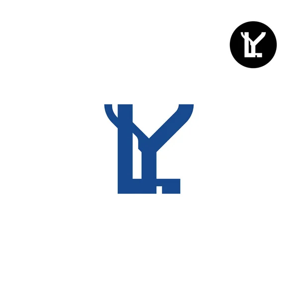

<a name="readme-top"></a>
<div align="center">
  <!-- You are encouraged to replace this logo with your own! Otherwise you can also remove it. -->
  
  <br/>

  <h3><b>Awesome Book with ES6</b></h3>

</div>

<!-- TABLE OF CONTENTS -->

# 📗 Table of Contents

- [📖 About the Project](#about-project)
  - [🛠 Built With](#built-with)
    - [Tech Stack](#tech-stack)
    - [Key Features](#key-features)
  - [🚀 Live Demo](#live-demo)
- [💻 Getting Started](#getting-started)
  - [Setup](#setup)
  - [Prerequisites](#prerequisites)
  - [Install](#install)
  - [Usage](#usage)
  - [Run tests](#run-tests)
  - [Deployment](#deployment)
- [👥 Authors](#authors)
- [🔭 Future Features](#future-features)
- [🤝 Contributing](#contributing)
- [⭐️ Show your support](#support)
- [🙏 Acknowledgements](#acknowledgements)
- [❓ FAQ (OPTIONAL)](#faq)
- [📝 License](#license)

<!-- PROJECT DESCRIPTION -->

# 📖 [Awesome Book] <a name="about-project"></a>

**[Awesome Book]** is a project build using ES6 feature of JavaScript. That it helps to add , delete and Save in local storage and retrive. I also used Luxon to add Time

## 🛠 Built With <a name="built-with"></a>

### Tech Stack <a name="tech-stack"></a>


<details>
  <summary>HTML</summary>
</details>

<details>
  <summary>CSS</summary>
</details>

<details>
<summary>JS</summary>
  <ul>
    <li><a href="https://www.postgresql.org/">PostgreSQL</a></li>
  </ul>
</details>

<!-- Features -->

### Key Features <a name="key-features"></a>

> features of the project

- [ ] **[Add_new_Books]**
- [ ] **[Remove_book_from_list]**
- [ ] **[Display_Book_List]**
- [ ] **[Add Time using Luxon Library]**
- [ ] **[Refactor using ES6]**

<p align="right">(<a href="#readme-top">back to top</a>)</p>

<p align="right">(<a href="#readme-top">back to top</a>)</p>

<!-- GETTING STARTED -->

## 💻 Getting Started <a name="getting-started"></a>

> You can use the project by using the following steps.

To get a local copy up and running, follow these steps.

### Prerequisites

In order to run this project you need to access the link of the project.

https://github.com/Yonasle/Awesome_Book
<!--
Example command:

```sh
 gem install rails
```
 -->

### Setup

Clone this repository to your desired folder:


cd Desktop/Microverse
git clone https://github.com/Yonasle/Awesome_Book
<!--
Example commands:

```sh
  cd my-folder
  git clone git@github.com:myaccount/my-project.git
```
--->

### Install

Install this project to your local repo:


cd Desktop/Microverse
code .
<!--
Example command:

```sh
  cd my-project
  gem install
```
--->

### Usage

To run the project, execute the following command:


cd Desktop
live-server


### Deployment

You can deploy this project using:

Not available

<p align="right">(<a href="#readme-top">back to top</a>)</p>

<!-- AUTHORS -->

## 👥 Authors <a name="authors"></a>


👤 **Yonas**

- GitHub: [@githubhandle](https://github.com/Yonasle)
- Twitter: [@twitterhandle](https://twitter.com/Yonasls)
- LinkedIn: [LinkedIn](https://www.linkedin.com/in/yonas-lemma-b8848823a/)

<p align="right">(<a href="#readme-top">back to top</a>)</p>

<!-- FUTURE FEATURES -->

## 🔭 Future Features <a name="future-features"></a>

> The following are the features of the project

- [ ] **[CSS layout]**
- [ ] **[Add link to each feature]**
- [ ] **[Using recent update of EcmaScript Feautres]

<p align="right">(<a href="#readme-top">back to top</a>)</p>

<!-- CONTRIBUTING -->

## 🤝 Contributing <a name="contributing"></a>

Contributions, issues, and feature requests are welcome!

Feel free to check the [issues page](../../issues/).

<p align="right">(<a href="#readme-top">back to top</a>)</p>


<p align="right">(<a href="#readme-top">back to top</a>)</p>

<!-- ACKNOWLEDGEMENTS -->
<!-- SUPPORT -->

## ⭐️ Show your support <a name="support"></a>

> Write a message to encourage readers to support your project

If you like this project...

<p align="right">(<a href="#readme-top">back to top</a>)</p>

<!-- ACKNOWLEDGEMENTS -->

## 🙏 Acknowledgments <a name="acknowledgements"></a>


We will like to thanks the student succes and Microverse coordinators for they give us such important task/project.


<p align="right">(<a href="#readme-top">back to top</a>)</p>


<p align="right">(<a href="#readme-top">back to top</a>)</p>

<!-- LICENSE -->

## 📝 License <a name="license"></a>

This project is [MIT](./LICENSE) licensed.


<p align="right">(<a href="#readme-top">back to top</a>)</p>
